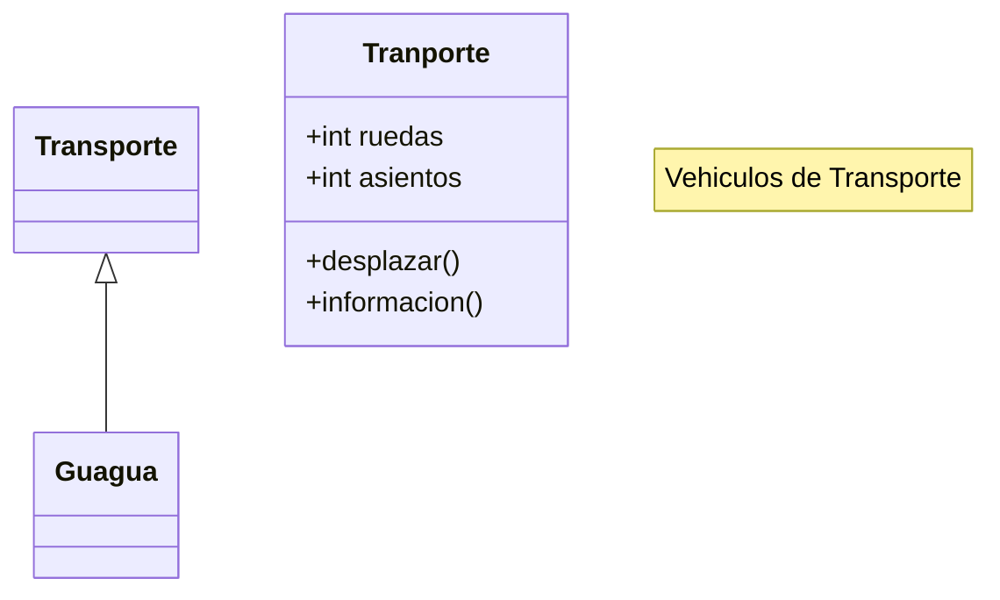
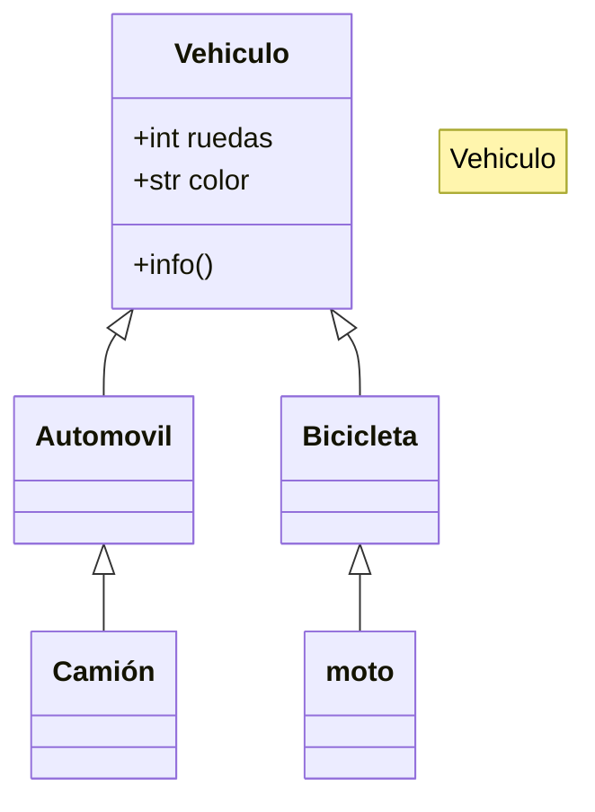

```mermaid
classDiagram
    note "Vehiculos de Transporte"
    Transporte <|-- Guagua

    Tranporte : +int ruedas
    Tranporte : +int asientos
    Tranporte : +desplazar()
    Tranporte : +informacion()
```

- intercity = Guagua
- lanzarote = Guagua

## Ejercicio 2

```mermaid
classDiagram
    note "Vehiculo"
    Vehiculo <|-- Automovil
    Automovil <|-- Camión
    Vehiculo <|-- Bicicleta
    Bicicleta <| -- moto
    Vehiculo : +int ruedas
    Vehiculo : +str color
    Vehiculo: +info()
```  
## Ejercicio 3
Escribir una clase que convierta un número entero en número romano

opción b: número romano a númerp entero